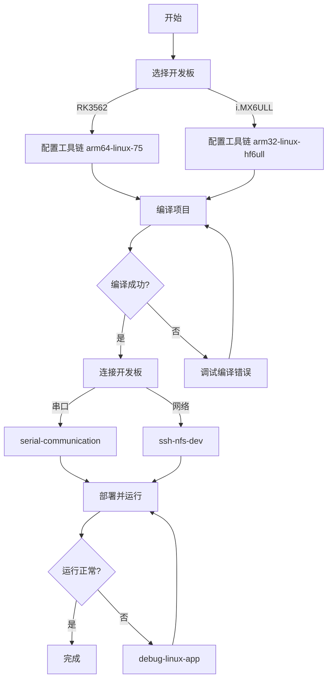
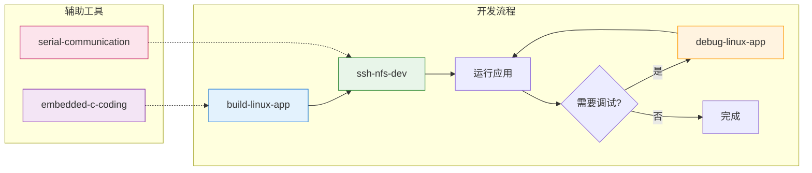

# Plug-Lens 项目技能指南

## 一、项目概述

**Plug-Lens** 是一个基于嵌入式 Linux 的视觉 AI 应用框架，采用事件总线和数据总线的双总线架构设计，实现模块间的松耦合通信。本项目支持 **RK3562** 和 **i.MX6ULL** 两种开发板。

## 二、核心技能列表

| 技能名称 | 功能描述 | 适用场景 |
|----------|----------|----------|
| `build-linux-app` | 构建 Linux 应用工程 | 配置/编译交叉编译项目 |
| `debug-linux-app` | 调试 Linux 应用程序 | 本地/远程 GDB 调试 |
| `serial-communication` | 串口通信工具 | 开发板串口登录、命令执行 |
| `ssh-nfs-dev` | SSH + NFS 远程开发 | 远程连接、文件同步、程序执行 |
| `embedded-c-coding` | 嵌入式C语言编码规范 | 代码审查、安全检查 |

## 三、开发工作流

### 3.1 快速上手流程



### 3.2 详细工作流

#### 步骤 1：选择目标平台

```bash
# RK3562 ARM64 开发板（推荐）
use_toolchain arm64-linux-75

# i.MX6ULL ARM32 开发板
use_toolchain arm32-linux-hf6ull
```

#### 步骤 2：构建项目

```bash
# 清理构建
make clean

# 编译 RK3562（软件模式）
make TARGET_PLATFORM=rk3562 ENGINE=software

# 编译 RK3562（硬件模式，需厂商库）
make TARGET_PLATFORM=rk3562 ENGINE=hardware

# 编译 i.MX6ULL
make TARGET_PLATFORM=imx6ull
```

#### 步骤 3：连接开发板

**方式一：串口连接**
```bash
# 使用 serial-communication 技能
# 自动检测串口并登录
```

**方式二：SSH连接**
```bash
# 使用 ssh-nfs-dev 技能
# 建立SSH连接：开发板 IP 默认 192.168.5.11
# 挂载NFS：/mnt/nfs
```

#### 步骤 4：部署与运行

```bash
# 通过NFS同步（推荐）
# 编译产物自动同步到开发板 /mnt/nfs

# 运行应用
cd /mnt/nfs/output
./vision_ai_app
```

#### 步骤 5：调试（如需要）

```bash
# 使用 debug-linux-app 技能
# 远程 GDB 调试
```

## 四、各技能详细说明

### 4.1 build-linux-app

**功能**：配置和构建基于 CMake/Makefile 的 Linux 应用工程

**适用场景**：
- 需要为 ARM32/ARM64 开发板进行交叉编译
- 需要在构建前确认环境是否就绪

**关键参数**：
| 参数 | 说明 | 默认值 |
|------|------|--------|
| TARGET_PLATFORM | 目标平台 | rk3562 |
| ENGINE | 引擎模式 | software |
| CROSS_COMPILE | 交叉编译前缀 | 自动检测 |

**执行步骤**：
1. 检测构建系统（CMake/Makefile）
2. 确认工具链环境
3. 执行编译
4. 输出构建产物路径

### 4.2 debug-linux-app

**功能**：调试 Linux 应用程序，支持本地和远程 GDB 调试

**适用场景**：
- 程序崩溃或异常行为分析
- 需要设置断点和检查变量
- 性能分析和优化

**执行步骤**：
1. 选择调试目标（本地/远程）
2. 设置断点
3. 启动调试会话
4. 分析执行流程

### 4.3 serial-communication

**功能**：串口通信工具，支持开发板登录和命令执行

**适用场景**：
- 开发板无网络连接时的调试
- 系统启动过程观察
- U-Boot 命令行操作

**预设配置**：
- 波特率：115200
- 数据位：8
- 停止位：1
- 校验位：无

### 4.4 ssh-nfs-dev

**功能**：SSH 远程连接和 NFS 文件共享

**适用场景**：
- 高效开发-测试循环
- 实时同步编译产物
- 远程程序执行

**网络配置**：
```
WSL2 IP:      192.168.5.10
开发板 IP:    192.168.5.11
子网掩码:     255.255.255.0
NFS挂载点:    /mnt/nfs
SSH用户:      root
```

### 4.5 embedded-c-coding

**功能**：嵌入式 C 语言编码规范检查

**适用场景**：
- 代码审查和质量检查
- 安全关键系统开发
- 内存安全和线程安全检查

**检查项**：
- OOP 设计模式
- 内存安全
- 线程安全
- 硬件交互规则

## 五、平台配置

### 5.1 RK3562 (ARM64)

**工具链**：
- `arm64-linux-75`: 软件模式（推荐）
- `arm64-linux-103`: 硬件模式（需要厂商库）

**第三方库**：
- `third_lib/aarch64/`: 通用 ARM64 库
- `third_lib/rk3562/`: RK3562 专用库（RGA、MPP、RKNN）

**编译命令**：
```bash
# 软件模式（使用 MNN + OpenH264）
make TARGET_PLATFORM=rk3562 ENGINE=software

# 硬件模式（使用 RKNN + RGA + MPP）
make TARGET_PLATFORM=rk3562 ENGINE=hardware
```

### 5.2 i.MX6ULL (ARM32)

**工具链**：`arm32-linux-hf6ull`

**第三方库**：`third_lib/imx6ull/`

**编译命令**：
```bash
make TARGET_PLATFORM=imx6ull
```

## 六、技能协作关系



**技能调用顺序**：
1. **embedded-c-coding** → 代码审查（可选）
2. **build-linux-app** → 编译项目
3. **serial-communication** → 串口连接（备用）
4. **ssh-nfs-dev** → 部署和运行
5. **debug-linux-app** → 调试（如需要）

## 七、常用命令速查

| 操作 | 命令 |
|------|------|
| 选择 RK3562 工具链 | `use_toolchain arm64-linux-75` |
| 选择 i.MX6ULL 工具链 | `use_toolchain arm32-linux-hf6ull` |
| 编译 RK3562 软件模式 | `make TARGET_PLATFORM=rk3562 ENGINE=software` |
| 编译 i.MX6ULL | `make TARGET_PLATFORM=imx6ull` |
| 清理构建 | `make clean` |
| 查看编译输出 | `ls output/` |

## 八、注意事项

### 8.1 安全红线

1. **备份规则**：执行破坏性操作前必须备份到本地
2. **固件烧录**：烧录前必须确认备份完整
3. **远程操作**：禁止在没有本地备份的情况下执行破坏性操作
4. **设备树修改**：禁止直接修改 `.dtsi` 文件，必须通过板级 `.dts` 或 overlay 修改

### 8.2 编译提示

- 首次编译可能需要较长时间
- 确保工具链路径已正确配置
- 硬件模式需要预先安装厂商提供的库文件
- 软件模式兼容性更好，适合快速验证

### 8.3 网络配置

- 开发板和 WSL2 需要在同一网段
- 推荐使用以太网直连（IP: 192.168.5.x）
- NFS 需要在开发板端预先配置

## 九、问题排查

| 问题现象 | 可能原因 | 解决方案 |
|----------|----------|----------|
| 编译失败：找不到工具链 | 未选择工具链 | 使用 `use_toolchain` 命令 |
| SSH 连接失败 | 网络不通或IP错误 | 检查网络配置 |
| NFS 挂载失败 | 服务未启动 | 在开发板上执行 `mount_nfs_wired` |
| 程序运行崩溃 | 缺少依赖库 | 检查库路径和 LD_LIBRARY_PATH |
| 人脸检测图片异常 | 尺寸配置错误 | 检查全局视频配置 |

## 十、参考文档

- [架构文档](docs/architecture.md) - 项目架构设计
- [RK3562 快速上手](docs/quick_start_zh-CN_rk3562.md) - RK3562 开发指南
- [i.MX6ULL 快速上手](docs/quick_start_zh-CN_imx6ull.md) - i.MX6ULL 开发指南
- [技能使用说明](.trae/skills/build-linux-app/references/usage.md) - 构建技能详细说明

---

*Plug-Lens v1.0.0 | 嵌入式视觉AI应用框架*
