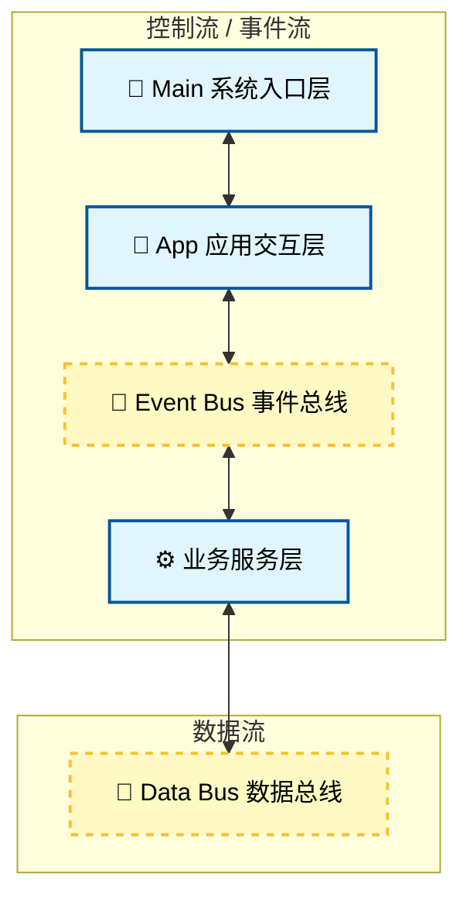

# 结构介绍


> [!NOTE]
> 这里的数据总线和事件总线都支持字符式注册多条.这也是我们为了消除全局变量的设计关键

**例如:**
```
/** 系统事件总线名称 | 系统级控制事件通信总线 */
#define SYS_EVENT_BUS_NAME        "sys_event"
/** 系统数据总线名称 | 通用数据传输总线 */
#define SYS_DATA_BUS_NAME         "sys_data"
/** 视频数据总线名称 | 摄像头YUYV原始帧总线（采集服务生产） */
#define VIDEO_DATA_BUS_NAME       "video"
/** AI RGB数据总线名称 | AI模型输入RGB帧总线（人脸服务生产） */
#define AI_RGB_DATA_BUS_NAME      "ai_rgb"
/** 人脸结果数据总线名称 | 人脸检测结果输出总线 */
#define FACE_YUV_DATA_BUS_NAME    "face_result"
/** H264流数据总线名称 | RTSP推流H264码流传输总线 */
#define H264_RTSP_DATA_BUS_NAME   "h264_stream_bus"
```