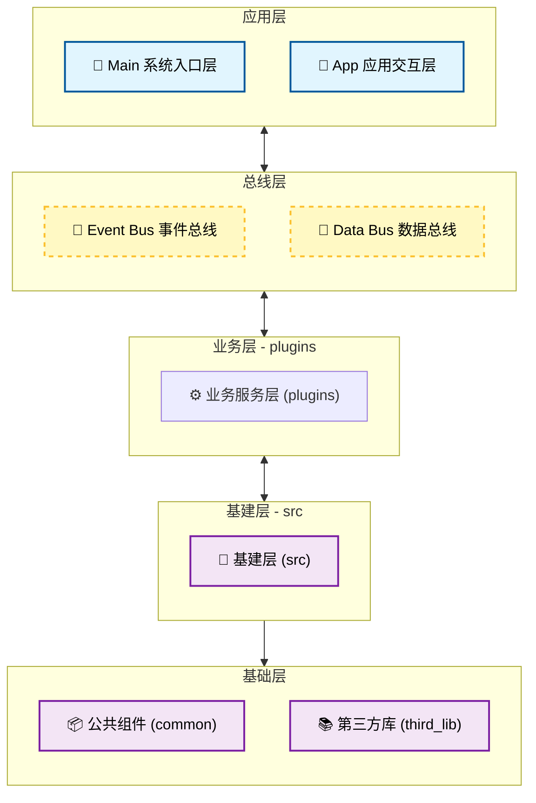

# 项目架构文档

## 一、项目概述

本项目是一个基于嵌入式 Linux 的视觉 AI 应用框架，采用**事件总线**和**数据总线**的双总线架构设计，实现模块间的松耦合通信，从根本上消除全局变量的使用。

### 1.1 设计思想

| 设计原则 | 说明 |
|----------|------|
| **去全局变量** | 通过数据总线和事件总线实现模块间通信 |
| **分层架构** | 基建层 → 插件层 → 应用层 清晰分离 |
| **接口封闭** | 源文件对内隐藏，只开放头文件接口 |
| **插件化业务** | 业务逻辑以插件形式动态加载 |

---

## 二、系统架构图



---

## 三、目录结构

```
plug-lens/
├── src/                    # 基建层（几乎不需要修改）
│   ├── base/               # 基础组件
│   │   ├── camera/        # 摄像头抽象
│   │   ├── ai_model/      # AI 模型抽象
│   │   └── led/           # LED 控制
│   ├── bus/               # 总线实现
│   │   ├── event_bus/     # 事件总线
│   │   └── data_bus/      # 数据总线
│   └── app/               # 应用入口
│
├── plugins/                # 插件层（主要开发区域）
│   ├── face_detect/       # 人脸检测服务
│   ├── rtsp_stream/       # RTSP 推流服务
│   └── ...
│
├── common/                # 公共组件（重点关注头文件）
│   ├── log/               # 日志组件
│   ├── queue/             # 队列组件
│   ├── thread/            # 线程组件
│   ├── pool/              # 内存池
│   ├── img_proc/          # 图像处理
│   └── ...
│
├── third_lib/             # 第三方库（按开发板分类）
│   ├── rk3562/            # RK3562 板级支持
│   │   ├── rkmpp/         # 多媒体处理
│   │   ├── rkrga/         # 图形加速
│   │   └── rknn/          # 神经网络推理
│   ├── rk3568/            # RK3568 板级支持
│   └── aarch64/            # ARM64 通用库
│       ├── MNN/            # MNN 推理
│       ├── live555/        # RTSP
│       └── ...
│
├── scripts/               # 手动脚本
│
├── docs/                  # 文档目录
│
├── board/                 # 板级支持层（预留）
│
├── build/                 # 编译中间产物
│
├── output/                # 编译产物输出
│   └── vision_ai_app     # 最终可执行文件
│
├── .tool/                 # 第三方库源码（用于交叉编译）
│   ├── mpp-1.0.12/       # MPP 源码
│   ├── rga-linux-rga-multi/  # RGA 源码
│   └── rknn-toolkit2-master/ # RKNN 工具链
│
├── Makefile               # 顶层 Makefile
├── Makefile.build         # 编译规则
└── .vscode/              # VSCode 配置
```

---

## 四、目录详解

### 4.1 `src/` - 基建层

**作用**: 项目的基础框架层，提供了系统运行的核心组件。

**特点**: 
- 几乎不需要修改
- 源文件隔离，对外只开放头文件接口

**核心子目录**:

| 目录 | 说明 |
|------|------|
| `src/base/camera/` | 摄像头抽象接口 |
| `src/base/ai_model/` | AI 模型抽象接口 |
| `src/base/led/` | LED 控制接口 |
| `src/bus/event_bus/` | 事件总线实现 |
| `src/bus/data_bus/` | 数据总线实现 |
| `src/app/` | 应用入口 (main.c) |

**关键文件**:
- `src/app/src/main.c` - 程序入口点

---

### 4.2 `plugins/` - 插件层（主要开发区域）

**作用**: 业务逻辑和服务实现的核心区域。

**特点**: 
- 实际代码实现
- 需要经常修改
- 可插拔设计

**典型插件**:

| 插件 | 说明 |
|------|------|
| `face_detect/` | 人脸检测服务 |
| `rtsp_stream/` | RTSP 推流服务 |

---

### 4.3 `common/` - 公共组件

**作用**: 各模块都可能用到的通用组件库。

**特点**: 
- 头文件对外开放
- 源文件对内隐藏
- 可复用性高

**核心组件**:

| 组件 | 说明 |
|------|------|
| `log/` | 日志系统 |
| `queue/` | 队列数据结构 |
| `thread/` | 线程管理 |
| `pool/` | 内存池分配 |
| `img_proc/` | 图像处理工具 |
| `event_bus/` | 事件总线封装 |
| `data_bus/` | 数据总线封装 |
| `plugin/` | 插件管理 |
| `initcall/` | 自动初始化 |
| `mem_adapter/` | 内存适配 |
| `daemon/` | 守护进程 |
| `sd_mount/` | SD 卡挂载 |
| `network/` | 网络工具 |
| `sys_time/` | 系统时间 |

---

### 4.4 `third_lib/` - 第三方库

**作用**: 按开发板分类的交叉编译库。

**特点**:
- 已编译好的库文件
- 可直接复制到目标板卡使用
- 按 SOC 平台分类

**RK3562 组件**:

| 库 | 说明 | 用途 |
|----|------|------|
| `rkmpp/` | 多媒体处理平台 | 视频编解码 (H.264/H.265) |
| `rkrga/` | 图形加速引擎 | 图像缩放、格式转换 |
| `rknn/` | 神经网络推理 | AI 模型 NPU 加速 |

---

### 4.5 `scripts/` - 手动脚本

**作用**: 开发者手动编写的辅助脚本。

---

### 4.6 `build/` - 编译中间产物

**作用**: 编译过程中的中间文件（.o、.d 等）。

**特点**: 不需要关注，make clean 会清理。

---

### 4.7 `output/` - 编译产物输出

**作用**: 最终可执行文件和链接库的输出目录。

**关键文件**:
- `output/vision_ai_app` - 主程序可执行文件

---

### 4.8 `board/` - 板级支持层

**作用**: 不同板子的特殊支持代码（预留设计）。

**特点**: 对于应用开发暂时不需要特别关注。

---

### 4.9 `.tool/` - 第三方库源码

**作用**: 第三方库的源代码，用于交叉编译。

**特点**:
- 不与项目直接关联
- 编译后复制产物到 `third_lib/` 使用
- 包含: mpp、rga、rknn-toolkit2 等

---

### 4.10 `docs/` - 文档目录

**作用**: 项目文档存放处。

---

## 五、总线设计

### 5.1 事件总线 (Event Bus)

**用途**: 系统控制命令和事件通知的传递。

**特点**: 支持字符串注册多条总线，实现模块间解耦。

**系统事件总线名称定义**:

```c
/** 系统事件总线名称 | 系统级控制事件通信总线 */
#define SYS_EVENT_BUS_NAME        "sys_event"
/** 系统数据总线名称 | 通用数据传输总线 */
#define SYS_DATA_BUS_NAME         "sys_data"
/** 视频数据总线名称 | 摄像头YUYV原始帧总线（采集服务生产） */
#define VIDEO_DATA_BUS_NAME       "video"
/** AI RGB数据总线名称 | AI模型输入RGB帧总线（人脸服务生产） */
#define AI_RGB_DATA_BUS_NAME      "ai_rgb"
/** 人脸结果数据总线名称 | 人脸检测结果输出总线 */
#define FACE_YUV_DATA_BUS_NAME    "face_result"
/** H264流数据总线名称 | RTSP推流H264码流传输总线 */
#define H264_RTSP_DATA_BUS_NAME   "h264_stream_bus"
```

### 5.2 数据总线 (Data Bus)

**用途**: 视频帧、AI 数据等大容量数据的传输。

**特点**: 支持多生产者多消费者模式。

---

## 六、编译说明

### 6.1 编译产物位置

| 产物类型 | 位置 |
|----------|------|
| 中间产物 | `build/` |
| 最终可执行文件 | `output/vision_ai_app` |
| 链接库 | `output/` |

### 6.2 编译命令

```bash
# 完整编译
make

# 清理
make clean
```

---

## 七、瑞芯微库集成

已在 Makefile 中添加 RK3562 组件支持：

### 7.1 头文件路径

```makefile
-I$(TOPDIR)/third_lib/rk3562/rkmpp/include
-I$(TOPDIR)/third_lib/rk3562/rkrga/include
-I$(TOPDIR)/.tool/rknn-toolkit2-master/rknpu2/runtime/Linux/librknn_api/include
```

### 7.2 库链接

```makefile
-L$(TOPDIR)/third_lib/rk3562/rkmpp/lib -lrockchip_mpp
-L$(TOPDIR)/third_lib/rk3562/rkrga/lib -lrga
-L$(TOPDIR)/third_lib/rk3562/rknn -lrknnrt
```
