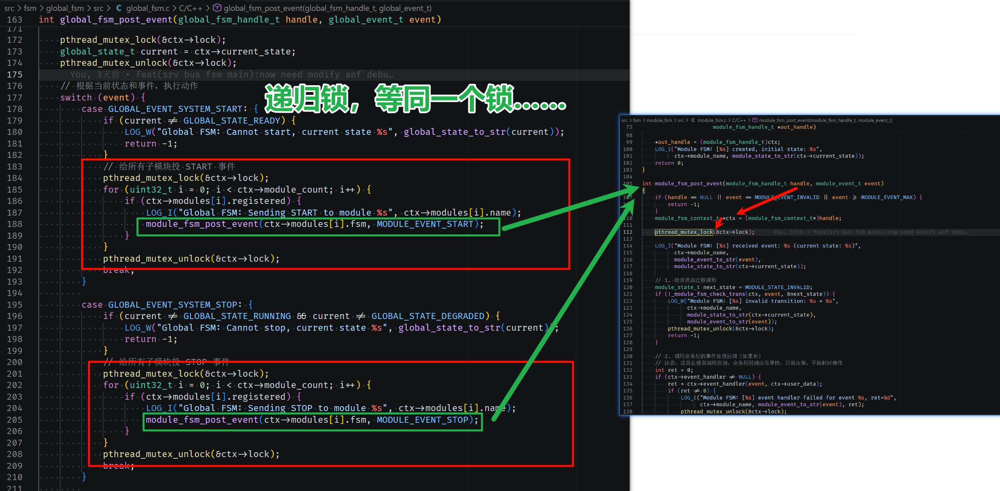

非常好！我们现在需要的就是**条理清晰**。

---

# 一、已做过的测试清单（全部无效）
我们按时间线整理一下，确保没有遗漏：

| 序号 | 测试内容 | 预期结果 | 实际结果 | 结论 |
| :--- | :--- | :--- | :--- | :--- |
| 1 | 降低 FPS 为 1 | 主线程压力减小，键盘响应 | ❌ 无效 | 不是帧率问题 |
| 2 | 注释掉 Demo App 事件订阅 | 不处理帧事件，键盘响应 | ❌ 无效 | 不是 Event Bus 消费问题 |
| 3 | 注释掉 Data Bus 所有日志 | 减少日志刷屏 | ❌ 无效 | 不是 Data Bus 日志问题 |
| 4 | 注释掉 Demo App 帧处理日志 | 减少主线程日志 | ❌ 无效 | 不是 Demo App 日志问题 |
| 5 | 采集线程添加 `usleep(10ms)` | 主动让出 CPU，主线程调度 | ❌ 无效 | 不是简单的 CPU 占满问题 |

---

# 二、后续测试方向（按可能性优先级排序）
既然上面的都无效，我们需要**更硬核、更底层**的定位手段：

### 优先级 1：**交叉编译静态GDBServer**
因为开发板内存仅剩300MB，这是唯一能直接看到**主线程卡在哪一行**的方法，没有之一。

### 优先级 2：**验证终端模式是否被破坏**
怀疑点：启动采集后，`main.c` 里设置的非规范终端模式（`ICANON` 关闭）被某种方式破坏了，导致 `read(STDIN)` 读不到数据。

### 优先级 3：**验证 `select` 本身是否正常工作**
怀疑点：`bus_fd` 的事件触发频率太高，导致 `select` 每次都返回 Bus 事件，**永远没机会检查到 `STDIN`**。

> 经过GDB调试后发现，主线程完全没有运行。并且一直在等锁。

# 三、最终问题

**global_fsm**「**自死锁**」或「**锁递归死锁**」：

线程持有锁 A

线程调用函数，函数试图拿锁 A

因为锁不是「递归锁」（默认都不是），线程直接永久休眠！

```
主线程
  |
  |-- global_fsm_post_event(GLOBAL_EVENT_SYSTEM_START)
  |     |
  |     |-- pthread_mutex_lock(&ctx->lock)  // 【第1次拿 Global FSM 锁】✅ 拿到了
  |     |
  |     |-- 遍历模块，调用 module_fsm_post_event(..., MODULE_EVENT_START)
  |           |
  |           |-- module_fsm_post_event 触发状态变化
  |                 |
  |                 |-- _capture_srv_fsm_state_relay (Capture Srv 状态中继)
  |                       |
  |                       |-- global_fsm_on_module_state_change (Global FSM 回调)
  |                             |
  |                             |-- pthread_mutex_lock(&ctx->lock)  // 【第2次拿 Global FSM 锁】❌ 拿不到！
  |                             |
  |                             '-- 永久等待（死锁！）
  |
  '-- 主线程持有锁，又等自己释放锁 → 死锁！
```

